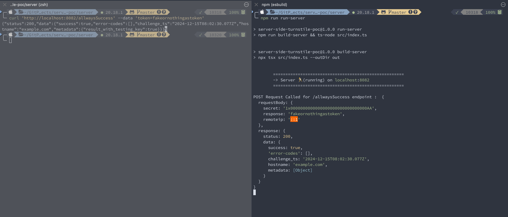

# Server Side Turnstile POC

## Turnstile server side validation

Documentation: https://developers.cloudflare.com/turnstile/get-started/server-side-validation/

## Start

> NodeJS 18+ is required

### initialize

```shell
# in ./server
npm install
```

### run server

```shell
# in ./server
npm run run-server
```

## Use

- 1: start server
- 2: curl server endpoint


